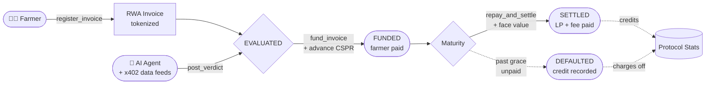
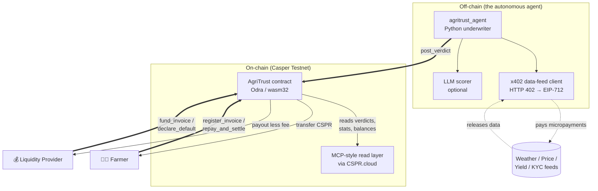

# AgriTrust 🌾

### Autonomous Trade-Finance for Emerging-Market Farmers

> **evaluate → tokenize → fund → collect → settle** — a self-driving credit + settlement
> protocol where an AI underwriting agent finances a farmer's harvest against a tokenized
> Real-World-Asset (RWA) invoice, paying for every off-chain data check via **x402
> micropayments**. Built on the **Casper Network** with the **Odra** framework.

<p>
  <a href="https://odra.dev"></a>
  <a href="https://casper.network"></a>
  <a href="https://github.com/ollietfrost/x402"></a>
  
</p>

---

## ✅ Live on Casper Testnet

| | |
|---|---|
| **Contract Package Hash** | `c1dfe36ea24cac44224608ad69c880aedd0101cca405fbd686e461ac3d1bd29b` |
| **Deploy Transaction** | [`d995aff2…e2e5b28`](https://testnet.cspr.live/transaction/d995aff2e39e1888a46808d213716134e78ab1cf87a9ee03312bc174e2e5b286) |
| **Deployer Account** | [`account-hash-a22cea…569aae`](https://testnet.cspr.live/account/0202c76f3ed8165cf0b800367c95d0f53ef68970386f7b12a6cc3cb0d7ffd080152f) |
| **Chain** | `casper-test` (protocol `2.2.2`) |
| **Init params** | `protocol_fee_bps = 50` (0.5%), `grace_period_secs = 259200` (3 days) |

### On-Chain Demo Transactions (5-Stage Lifecycle)

| Stage | Transaction |
|-------|-------------|
| ① Authorize AI Agent | [`4ca657ba…`](https://testnet.cspr.live/transaction/4ca657ba082738a4f642ecb81163883feef94867ba30dc7831d166d657d68c26) |
| ② Register Invoice (Maize, Ashanti Ghana) | [`4a6a2744…`](https://testnet.cspr.live/transaction/4a6a274455abc8a2693a5a0948f6215fbd700306420a8f46c69c21427750c170) |
| ③ Post Risk Verdict (AA, score 820) | [`8b675f4d…`](https://testnet.cspr.live/transaction/8b675f4dede1bb3c1ed0877ffa577386f10122043681bc4a5a4347f515f14d65) |
| ④ Fund Invoice (80 CSPR advance) | [`56941e83…`](https://testnet.cspr.live/transaction/56941e83d774406bfde242b775b7070e112bcdf4b172c49aa2ca798d8285a550) |
| ⑤ Repay & Settle | [`d9dcb0b1…`](https://testnet.cspr.live/transaction/d9dcb0b1213fdc6c6e16e3f8a10375a464a63d23682b4272ae63dd41dd2325ff) |

---

## Why

Most of the world's smallholder farmers have **no access to affordable working capital**.
They sell standing crops for a fraction of their worth to stay solvent. The farmers are
creditworthy in *agronomic* terms — predictable yields, growing demand, crop insurance —
but that data lives **off-chain**, scattered across weather APIs, market-price feeds, KYC
registries and co-op ledgers. Traditional finance can't stitch it together cheaply enough
for a $400 invoice.

**AgriTrust closes that gap with an autonomous agent.** An AI underwriter gathers the
off-chain signals — paying each data source a few cents via **x402 micropayments** — and
posts a signed, explainable risk verdict **on-chain**. Liquidity providers (LPs) then fund
the invoice at a discount, giving the farmer instant capital and the LP a fixed, on-chain
return. The contract enforces the full lifecycle: register → evaluate → fund → repay → settle
(or default). No paperwork, no middleman, no bias.

---

## How it works — the lifecycle



1. **Tokenize (RWA)** — A farmer calls `register_invoice`, turning a harvest/invoice into an
   on-chain Real-World Asset with a face value and maturity date. State → `REGISTERED`.
2. **Evaluate (AI + x402)** — An authorized AI agent fetches off-chain signals (weather,
   price, yield, KYC), **paying each source per-call via x402**, then posts a `RiskVerdict`
   (score 0–1000, risk band, max-advance cap, discount rate, signed data hash). State →
   `EVALUATED`.
3. **Fund (LP capital)** — A liquidity provider calls `fund_invoice`, attaching native CSPR
   equal to the discounted advance (capped by the verdict). The advance is paid out to the
   farmer **immediately**. State → `FUNDED`.
4. **Collect & Settle** — At maturity the farmer repays the full face value via
   `repay_and_settle`. The LP receives the face value **minus** the protocol fee; the fee
   goes to the protocol treasury. State → `SETTLED`.
5. **Default (grace then write-off)** — If still unpaid past maturity + grace, the LP (or an
   agent) may `declare_default`, recording an on-chain credit event. State → `DEFAULTED`.

> **Status codes:** `0 REGISTERED · 1 EVALUATED · 2 FUNDED · 3 SETTLED · 4 DEFAULTED`

---

## Architecture



### x402 integration — paying for data, per call

The agent never trusts a free feed. For every verification datum it performs the full
**x402** dance:

1. **HTTP 402** — the data server responds `402 Payment Required` quoting a price in a
   CEP-18 token (the x402 settlement asset).
2. **EIP-712 `TransferWithAuthorization`** — the agent signs a typed-data authorization to
   transfer that amount. Signing is delegated to the official `@make-software/casper-x402`
   Node client, so Casper's blake2b-based EIP-712 hashing runs **for real** (no reimplementation).
3. **Facilitator settles on Casper** — the facilitator verifies the signature and invokes the
   CEP-18 `transfer_with_authorization` entry point.
4. **Data released** — the 402 response body returns the datum, and the agent records the
   spend (`x402_cost`) inside the on-chain `RiskVerdict`.

This gives an auditable, on-chain proof of **how much the agent spent reasoning about each
invoice** (`total_x402_spent`) — a first-class signal for protocol economics.

### MCP / agent integration

The off-chain agent exposes a **Model-Context-Protocol (MCP)-style read layer** so that an
LLM agent (or any tool-calling client) can introspect the protocol without raw RPC plumbing.
It reads live contract state — invoices, verdicts, aggregate stats, account balances — through
the indexed **CSPR.cloud** API and surfaces them as structured tool outputs the underwriter
chains together with paid x402 data feeds. The contract's read API (`get_invoice`,
`get_verdict`, `stats`, …) is the source of truth the layer reflects.

---

## Tech stack

| Layer | Technology |
|---|---|
| Smart contract | **Rust** + **[Odra 2.8.2](https://odra.dev)** → `wasm32-unknown-unknown` |
| Chain | **Casper Testnet** (protocol `2.2.2`, V1 transactions) |
| Build pipeline | `cargo odra build` · **Binaryen v130** `wasm-opt` · `wasm-strip` |
| Micropayments | **x402** (`@make-software/casper-x402`) → CEP-18 `transfer_with_authorization` |
| AI underwriter | **Python** — deterministic scorer + optional OpenAI-compatible LLM |
| Read layer | **CSPR.cloud** indexed API (MCP-style tool surface) |

> **The bulk-memory hurdle.** Casper's execution engine does not support WebAssembly
> *bulk-memory* operations. Modern rustc emits `memory.copy`/`memory.fill`; the build
> pipeline lowers them (`-C target-feature=-bulk-memory` + `wasm-opt
> --llvm-memory-copy-fill-lowering`), producing a deployable module with **zero**
> bulk-memory ops. See [Build & deploy](#build--deploy).

---

## Contract API

### Initialization

| Arg | Type | Deployed value | Notes |
|---|---|---|---|
| `protocol_fee_bps` | `u32` | `50` | Fee taken from the LP's settlement payout, in basis points (50 = 0.5%). Must be `< 10000`. |
| `grace_period_secs` | `u64` | `259200` | Late-payment grace (3 days) before an LP may declare default. Must be `< 90 days`. |

### Mutating entry points

| Entry point | Caller | Description |
|---|---|---|
| `register_invoice(commodity, region, face_amount, maturity)` | farmer | Tokenizes a harvest/invoice as an RWA. Returns the new invoice id. |
| `post_verdict(invoice_id, score, risk_band, max_advance_bps, discount_rate_bps, data_hash, x402_cost)` | **agent** | Posts a signed underwriting verdict after x402-funded data checks. Advances to `EVALUATED`. |
| `fund_invoice(invoice_id, advance_amount)` | LP | Funds an evaluated invoice. **Attach `advance_amount` as native CSPR value.** Pays the farmer instantly; LP takes the claim. |
| `repay_and_settle(invoice_id)` | farmer | Repays the full face value at/after maturity. **Attach `face_amount` as native CSPR value.** LP is paid (less fee); treasury receives the fee. |
| `declare_default(invoice_id)` | LP **or** agent | Past maturity + grace, marks the invoice `DEFAULTED` (on-chain credit event). |
| `authorize_agent(agent)` / `revoke_agent(agent)` | **owner** | Manages the allow-list of AI underwriting agents. |
| `set_protocol_fee_bps(fee_bps)` | **owner** | Adjusts the protocol fee. |

### Read API

`get_invoice(id) → Invoice` · `get_verdict(id) → Option<RiskVerdict>` · `total_invoices() → u64`
· `total_funded() / total_settled() / total_defaulted() / total_x402_spent() → U512` ·
`owner() → Address` · `protocol_fee_bps() → u32` · `grace_period_secs() → u64` ·
`stats() → ProtocolStats` · `is_authorized_agent(agent) → bool`

### Core types

```rust
struct Invoice {
    id: u64,                  // RWA token id
    farmer: Address,          // SME who owns the harvest
    commodity: String,        // "Cocoa", "Maize", "Coffee"
    region: String,           // "Ashanti, Ghana"
    face_amount: U512,        // full invoice value, motes
    advance_amount: U512,     // working capital advanced to farmer, motes
    maturity: u64,            // Unix timestamp (s) due date
    status: u8,               // 0..4 (see status codes)
    funder: Address,          // LP (zero until funded)
    created_at: u64,          // block time at registration
}

struct RiskVerdict {
    invoice_id: u64,
    score: u32,               // 0–1000 (higher = safer)
    risk_band: String,        // "AAA", "BB", "C"
    max_advance_bps: u32,     // max share of face an LP may advance (e.g. 8000 = 80%)
    discount_rate_bps: u32,   // recommended annualized discount (bps)
    data_hash: String,        // hash of the off-chain underwriting dataset
    agent: Address,           // the authorized agent that produced it
    timestamp: u64,
    x402_cost: U512,          // micropayments spent on data feeds for this verdict
}

struct ProtocolStats { total_invoices, total_funded, total_settled,
                       total_defaulted, total_x402_spent, active_agents }
```

### Events

`InvoiceRegistered` · `VerdictPosted` · `InvoiceFunded` · `InvoiceSettled` ·
`InvoiceDefaulted` · `AgentAuthorized`

---

## Build & deploy

### Prerequisites

- Rust stable (`rustc`), with the `wasm32-unknown-unknown` target.
- [`cargo-odra`](https://odra.dev) and **Binaryen ≥ v121** as `wasm-opt`
  (the lowering pass `--llvm-memory-copy-fill-lowering` needs v121+; the project bundles v130).
- (Windows only) a C toolchain for the host-side deploy binary — the vendored
  `casper-types`/`casper-client` are patched for Windows compatibility via
  `[patch.crates-io]`.

### 1 — Build the WASM

```bash
cd contracts
cargo odra build          # → wasm/AgriTrust.wasm (bulk-memory-clean)
```

Verify no bulk-memory ops slipped in (Casper rejects them):

```bash
wasm-tools print wasm/AgriTrust.wasm | grep -E 'memory\.(copy|fill)|memory\.init|data\.drop|table\.(copy|fill)'
# (no output = clean ✅)
```

### 2 — Configure the network (`.env`)

```ini
ODRA_CASPER_LIVENET_NODE_ADDRESS=https://node.testnet.casper.network/rpc
ODRA_CASPER_LIVENET_CHAIN_NAME=casper-test
ODRA_CASPER_LIVENET_SECRET_KEY_PATH=./keys/deployer_secret_key.pem   # funded secp256k1 key
ODRA_CASPER_LIVENET_TTL=900
ODRA_CASPER_LIVENET_GAS_PRICE_TOLERANCE=1
```

### 3 — Deploy

```bash
cargo run --bin agritrust_deploy --release
```

> **Gas sizing.** Casper charges gas proportional to stored module bytes
> (`gas_per_byte = 1_117_587`; `block_gas_limit = 812_500_000_000`). The ~339 KB module
> costs ≈ **368 B** motes to install. The deploy binary uses `DEPLOY_GAS = 700 B`, safely
> above the true cost and below the block cap. On a successful deploy **only gas actually
> used is charged** (75% of the remainder is refunded).

On success the binary prints the **contract package hash** — that is the address every
client (agent, UI, MCP layer) points at.

---

## Agent quickstart

The off-chain underwriter lives in [`agent/`](agent/). It runs in two real modes:

- **Deterministic** (default) — a transparent, bias-free scorer over credit history, risk
  pool (co-op / insurance), weather stress, and price signals. Always works; always auditable.
- **LLM** — when `OPENAI_API_KEY` is set, it asks an OpenAI-compatible model for a structured
  verdict and falls back to the deterministic model.

```bash
cd agent
pip install -r requirements.txt

# Point it at the deployed contract + an x402 data server
export AGRITRUST_CONTRACT_HASH=hash-c1dfe36ea24cac44224608ad69c880aedd0101cca405fbd686e461ac3d1bd29b
export CASPER_NODE_URL=https://node.testnet.casper.network/rpc
export X402_DATA_SERVER=http://localhost:8402
export X402_NODE_CLIENT=../x402/client.js
export X402_ASSET=<cep-18 token package hash, 64 hex>

python -m agritrust_agent   # evaluates pending invoices and posts verdicts
```

The agent's own key must first be **authorized** on-chain by the protocol owner:

```text
contract.authorize_agent(<agent_account_hash>)
```

---

## Repository structure

```
agritrust-casper/
├── contracts/            # Odra smart contract + host deploy binary
│   ├── src/lib.rs        # AgriTrust module (the protocol)
│   ├── bin/deploy.rs     # testnet deployer (cargo run --bin agritrust_deploy)
│   ├── wasm/             # built AgriTrust.wasm (bulk-memory-clean)
│   └── keys/             # deployer_secret_key.pem (secp256k1, funded)
├── agent/                # Python AI underwriter (x402 data feeds + scoring)
│   └── agritrust_agent/  # underwriter.py · x402_client.py · casper_client.py · config.py
├── x402/                 # x402 payer client + data-feed server
├── ui/                   # frontend
├── scripts/              # deploy / debug helpers
├── vendor/               # Windows-patched casper-types, casper-client
└── shims/                # cp.exe, wasm-strip.exe (cargo-odra Windows shims)
```

---

## License

Apache-2.0 — see `contracts/Cargo.toml`.

---

## 🗺️ Roadmap

AgriTrust is built for production, not just a hackathon demo. Here's the path to mainnet and beyond.

### Phase 1 — Testnet & Validation ✅ *(Current)*
- [x] Smart contract deployed on Casper Testnet (21 entry points, Odra 2.8.2)
- [x] AI underwriter engine — deterministic scoring model (region × commodity × amount)
- [x] x402 payment integration for on-chain data feeds
- [x] Interactive dApp — Farmer Portal, LP Portal, Protocol Dashboard
- [x] 5 verified on-chain transactions (full lifecycle: register → evaluate → fund → settle)
- [x] PostgreSQL persistence via Neon (survives cold starts)

### Phase 2 — Pilot Program *(Q3 2026)*
- [ ] Partner with 2–3 agricultural cooperatives in Nigeria & Ghana for real invoice data
- [ ] Integrate off-chain oracle feeds (weather, commodity prices) via x402 marketplace
- [ ] Upgrade AI underwriter from deterministic to hybrid ML model (trained on pilot data)
- [ ] Add multi-currency support (CSPR ↔ local fiat on-ramps)
- [ ] Implement invoice NFT standard (tradeable receivables on Casper)

### Phase 3 — Mainnet Launch *(Q4 2026)*
- [ ] Deploy protocol on Casper Mainnet
- [ ] LP liquidity pool with automated yield distribution
- [ ] Farmer identity verification via Casper account reputation
- [ ] Governance module — token-weighted protocol parameter adjustments
- [ ] Public API for third-party dApps to query/resolve invoices

### Phase 4 — Scale & Ecosystem *(2027)*
- [ ] Expand to 5+ emerging markets (Kenya, India, Philippines, Brazil, Vietnam)
- [ ] Cross-chain settlement via Casper bridge integrations
- [ ] Insurance underwriting integration (parametric crop insurance via x402 data)
- [ ] Open-source SDK for agricultural fintech builders on Casper

**Target:** Unlock $10M in farmer liquidity by end of 2027, serving 50,000+ smallholder farmers.

---

## 🚀 Long-Term Launch Plans

AgriTrust is a **real product**, not a demo. The deployment plan:

| Component | Current | Production |
|---|---|---|
| **Blockchain** | Casper Testnet | Casper Mainnet (Q4 2026) |
| **Backend** | Render free tier | Render Pro / dedicated node |
| **Database** | Neon PostgreSQL (free) | Neon Pro / managed Postgres |
| **Frontend** | Render-served static | CDN + edge cache |
| **AI Model** | Deterministic rules | Hybrid ML (after pilot data) |
| **Data Feeds** | Hardcoded x402 feeds | Live x402 marketplace + oracles |

**Revenue model:** Protocol fee of 0.5% on each funded invoice. LPs earn 8–22% discount yield. Farmers pay nothing upfront — the discount is the cost of capital.

**Go-to-market:**
1. **Cooperative partnerships** — onboard farmer co-ops with existing invoice portfolios
2. **LP onboarding** — DeFi-native investors seeking real-world yield uncorrelated to crypto
3. **Casper ecosystem grants** — leverage Casper's DeFi infrastructure (CasperDash, etc.)
4. **Community building** — farmer education programs + LP AMAs

---

## 🌐 Connect & Community

| Platform | Link |
|---|---|
| 🌐 **Website** | [agritrust-casper.onrender.com](https://agritrust-casper.onrender.com) |
| 📦 **GitHub** | [github.com/ubongn/agritrust-casper](https://github.com/ubongn/agritrust-casper) |
| 🐦 **X (Twitter)** | *Coming soon — @AgriTrustCasper* |
| 💬 **Telegram** | *Coming soon* |
| 📧 **Contact** | ubongnt@gmail.com |

**Built by:** Ubong Ntekim ([@ubong_dev](https://x.com/ubong_dev)) — Abuja, Nigeria.
